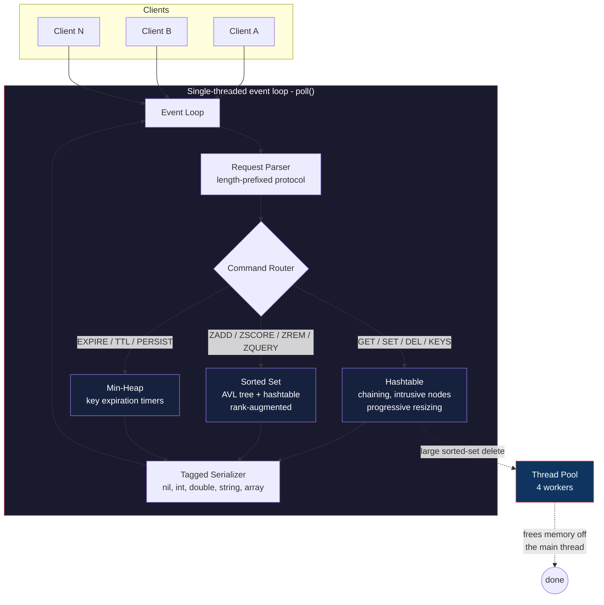

# build-your-own-redis

A Redis server built from scratch in C — raw sockets, a hand-rolled event loop, a hashtable and an AVL tree implemented from first principles, and a thread pool for background cleanup. No Redis source code, no networking libraries, no STL/C++ containers. Just the C standard library and the Linux socket API.

This isn't a wrapper around an existing library pretending to be Redis — every data structure (the hashtable, the AVL tree, the binary heap, the growable buffer) is implemented by hand, and every commit is a working, runnable server with more capability than the last.

## Why this exists

Most "build your own X" projects stop at "it compiles and runs once." This one is built commit-by-commit, and **every commit is tested for correctness before moving to the next one** — including stress tests at scale, and multiple passes under AddressSanitizer, UndefinedBehaviorSanitizer, and ThreadSanitizer. The [Benchmarks](#benchmarks) and [Bugs Found & Fixed](#bugs-found-and-fixed-along-the-way) sections below are real results from that process, not aspirational claims.

## Architecture



Everything in the event loop runs on **one thread** — concurrency comes from non-blocking sockets and `poll()`, not from spawning a thread per client. The thread pool exists for exactly one purpose: freeing very large sorted sets without blocking every other connected client while it happens (see [Benchmarks](#benchmarks)).

## Features

| Category | Commands |
|---|---|
| Strings | `GET`, `SET`, `DEL` |
| Introspection | `KEYS` |
| Sorted sets | `ZADD`, `ZSCORE`, `ZREM`, `ZQUERY` (range + rank queries) |
| Expiration | `EXPIRE`, `TTL`, `PERSIST` |

Under the hood:

- **Non-blocking event loop** (`poll()`) — handles an arbitrary number of concurrent clients on a single thread, no thread-per-connection.
- **Custom chaining hashtable** — intrusive linked-list nodes (no separate allocation per entry), FNV-1a hashing, **progressive resizing** so a rehash never freezes the server, even mid-resize.
- **Custom AVL tree** — height-balanced, augmented with subtree size for **O(log N) rank queries** (the same technique that makes `ZRANGE`-style pagination fast in real Redis, instead of O(offset) like a naive SQL `OFFSET`).
- **Tagged binary serialization** — a small Tag-Length-Value protocol (nil / error / string / integer / double / array, arrays can nest) instead of a fixed response shape.
- **TTL expiration** — a binary min-heap of key expiration times, checked every event loop iteration; expired keys are deleted with zero client involvement.
- **Idle connection timeouts** — a doubly-linked list, since every connection shares the same timeout duration, keeping eviction O(1).
- **Thread pool** — offloads freeing very large sorted sets to a background thread so deleting a 400,000-member sorted set doesn't stall every other client.

## Why C, not C++

C++'s `std::vector` and `std::string` would have made several of these components close to trivial. Writing them by hand in C — a growable byte buffer, a hashtable, an AVL tree with manual rotations and rebalancing, a binary heap — means there's no safety net: every allocation, every pointer, every edge case is something I had to reason through myself. That's a deliberately harder path than necessary, and that's the point.

## Benchmarks

Real numbers, from real tests, run against the actual binaries in this repo.

**Thread pool impact** — deleting a 400,000-member sorted set, measuring how long a *concurrent, unrelated* `GET` from another client takes while that delete is in flight:

| Build | Concurrent GET latency |
|---|---|
| Synchronous delete (thread pool disabled) | **34.4 ms** |
| Thread pool enabled (this repo, default) | **3.6 ms** |

A ~10x reduction — and 3.6ms is right around pure round-trip overhead, meaning the concurrent client barely noticed the huge delete was happening at all.

**Hashtable correctness at scale** — inserted 2,000 keys (well past what a naive linear-scan store could handle), verified all 2,000 return correct values, deleted every 3rd key and re-verified the rest, confirmed correctness held through multiple resize events triggered along the way.

**Sanitizer coverage** — the full command set (including sorted sets, TTLs, and concurrent thread-pool activity) has been run clean under:
- AddressSanitizer + UndefinedBehaviorSanitizer — zero memory errors
- ThreadSanitizer — zero data races, across concurrent deletes and unrelated client activity happening simultaneously

## Bugs found and fixed along the way

Kept here on purpose — these were real, not staged, and finding + fixing them is arguably worth more than the code that never had a bug in it.

- **Use-after-free in the hashtable's scan function.** The original `h_scan()` read a node's `next` pointer *after* invoking a callback on it — safe for a callback that only reads data, but a live bug once a callback that *frees* the node was added (for cleaning up a deleted sorted set). Fixed by capturing `next` before the callback runs; verified under AddressSanitizer against the exact scenario that would have triggered it.
- **Unvalidated buffer reads in the client's response parser.** A stale server process speaking an older protocol version produced a malformed reply, which the client parsed by reading past the end of the received buffer — undefined behavior. Fixed with explicit bounds checks before every field read, turning a potential crash into a clean `(truncated response)` error.
- **Declaration-order bugs (twice)** — C doesn't forward-declare automatically like some languages do; two commits initially placed a function before something it depended on was declared, caught immediately by the compiler and fixed by reordering.

## Building and running

```sh
make
./server &
./client set name raghava
./client get name
./client zadd leaderboard 100 alice
./client zquery leaderboard 0 "" 0 10
./client expire name 5000
./client ttl name
```

## Command reference

| Command | Example | Returns |
|---|---|---|
| `SET key value` | `set name raghava` | `OK` (nil) |
| `GET key` | `get name` | the value, or `(nil)` |
| `DEL key` | `del name` | `1` if removed, `0` if it didn't exist |
| `KEYS` | `keys` | array of all keys |
| `ZADD key score member` | `zadd board 100 alice` | `1` if new, `0` if updated |
| `ZSCORE key member` | `zscore board alice` | the score, or `(nil)` |
| `ZREM key member` | `zrem board alice` | `1` if removed, `0` if it didn't exist |
| `ZQUERY key score member offset limit` | `zquery board 0 "" 0 10` | array of `(member, score)` pairs |
| `EXPIRE key ms` | `expire name 5000` | `1` if the key existed |
| `TTL key` | `ttl name` | ms remaining, `-1` no TTL, `-2` no key |
| `PERSIST key` | `persist name` | `1` if a TTL was removed |

## Project structure

```
server.c   - the server: event loop, hashtable, AVL tree, heap, thread pool
client.c   - a small CLI client speaking the same wire protocol
Makefile   - build config (links pthread for the server)
```

## Roadmap (commit history)

- [x] Commit 1 — basic blocking TCP server and client
- [x] Commit 2 — length-prefixed request/response protocol
- [x] Commit 3 — non-blocking event loop (`poll()`), multi-client support
- [x] Commit 4 — real GET/SET/DEL commands (placeholder linear-scan store)
- [x] Commit 5 — chaining hashtable with intrusive nodes and progressive resizing
- [x] Commit 6 — tagged (TLV) response serialization, `KEYS` command
- [x] Commit 7 — AVL tree + sorted sets (`ZADD`/`ZSCORE`/`ZREM`/`ZQUERY`)
- [x] Commit 8 — idle-connection timeouts, key TTL/expiration
- [x] Commit 9 — thread pool for background cleanup of large sorted sets

## License

MIT
